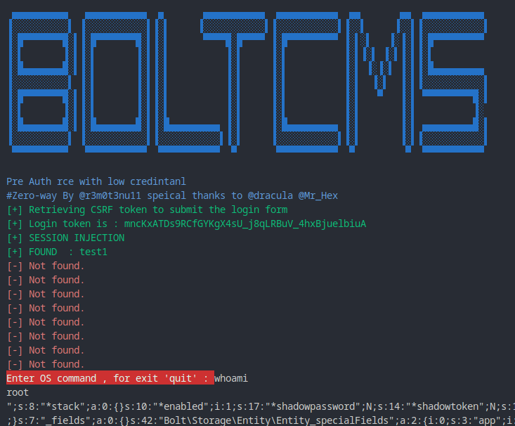
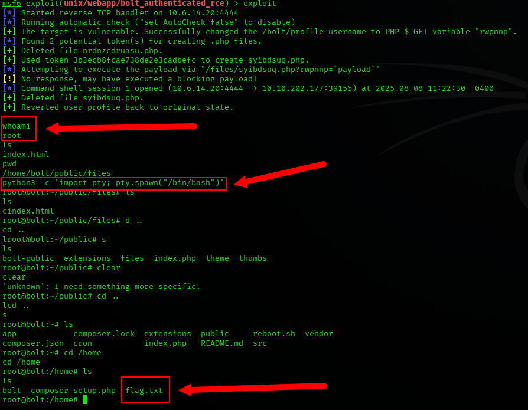

# Bolt - Writeup

## About
This room is about Bolt CMS and it can be exploited using Authenticated Remote Code Execution.

## Walkthrough

#### Information Gathering
At this stage, the information I got was basically that the webserver is running a Bolt CMS somewhere and it was vulnerable to a Authenticated RCE.

#### Enumeration 
At Enumeration stage, running nmap I found ports 22, 80 and 8000.
Basically, ports 22 and 80 are not revelant.
22 is just a SSH service and 80 is an apache but nothing that interesting.
**but** at port 8000 I found something cool. A web server running the Bolt CMS mentioned before.

#### Exploitation
At this point, when I accessed the <http://machine__ip:8000/> I ended up on the Bolt CMS initial page. There were some comments and a lot of valuable information. 
First, there was a message for IT Department from Admin (named Jake). Basically, Jake thinks its a secret forum and writes its password.
When I scrolled down a bit after this message, there was another one welcoming everyone to the site, introducing himself and saying that his username was **bolt**. 

Searching more about Bolt CMS, I found that the login page is under /bolt/login endpoint. Entering username and password that Jake told me (lol), I could login. So, these credentials are working perfectly.

At the beginning, the room said that there are a RCE vuln in this Bolt CMS version. I searched on exploitdb for "bolt" and *voilà*. There it is:
**Bolt CMS 3.7.0 - Authenticated Remote Code Execution**

I won't describe exactly what this script does but basically it's a python script that requires only three arguments: url, username and password.

So, I ran it against the Bolt's webserver and voilà (again haha), I got a shell inside it. When I typed `whoami` command, it told me I was **root**. 

But this shell itself isn't easy to do things. I tried to upgrade it to a fully interactive shell using `python3 -c 'import pty; pty.spawn("/bin/bash")'` but it only made the machine freeze and crash. 

So, I had to do it on another way. Reading the room questions, it says that Metasploit has an exploit nodule for this vulnerability. So I opened msfconsole and searched for it. It's called `exploit/unix/webapp/bolt_authenticated_rce`. Essentially, I only had to set LHOST, LPORT, RHOST, USERNAME, PASSWORD variables. After doing it, I ran the exploit against the server again and got a better shell. Upgraded it and this time it worked. So I could fully use it. The flag was at the user's home dir.

#### And that's all!
### Thank you for reading :)